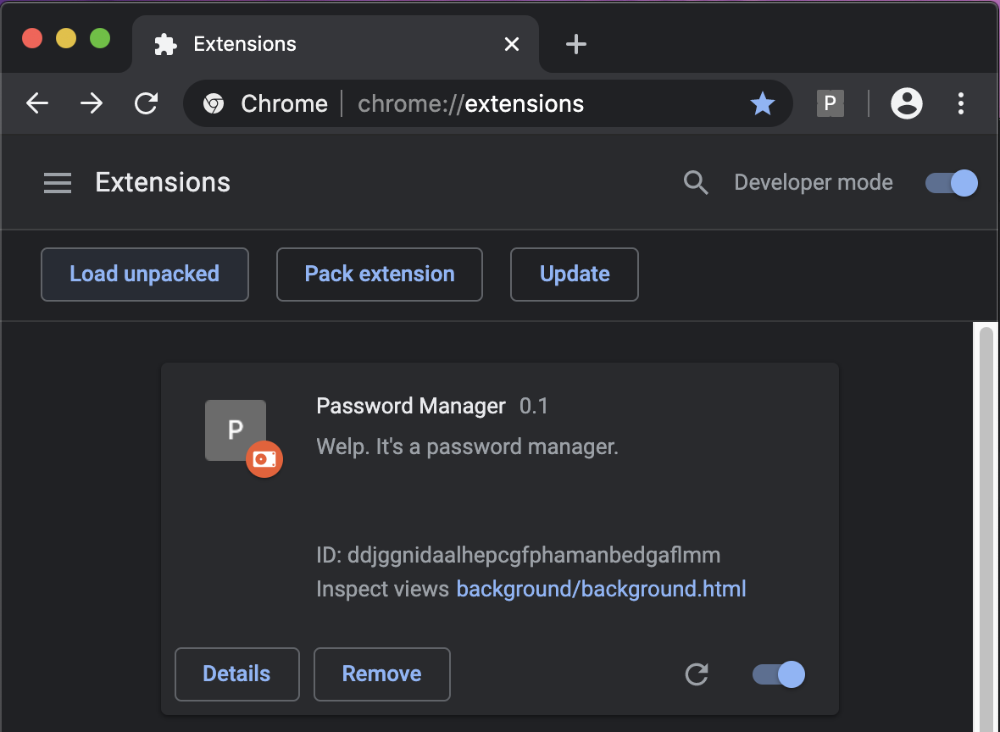
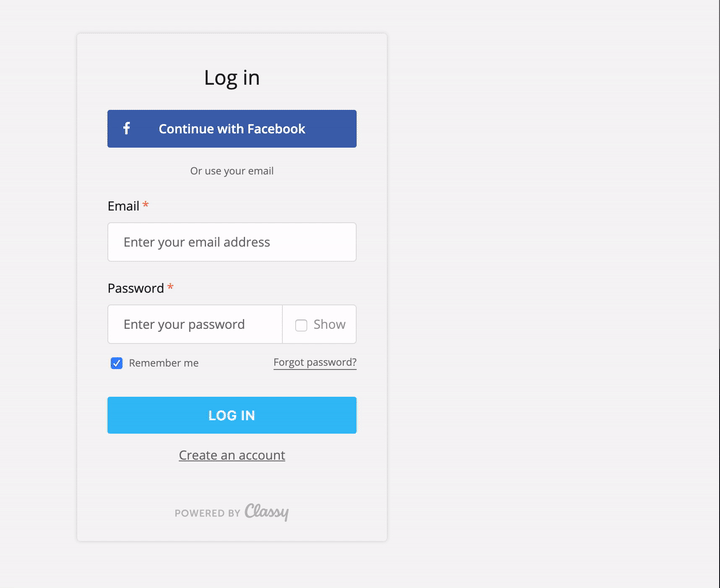

Password Manager
========================
COSC 302 - Final Project: University of Tennessee, Knoxville

[Austin Jones](https://github.com/ajone239),[Gauge Zidlick](github.com/gzidlick),[Landon Harris](https://github.com/lharri73)

**Disclaimer!!**
-------
**This is not intended for actual use in a setting where security is the priority.**
**This was made as  project in order to learn the tools needed to build a good web extension and learn some basic crytopgraphy.**

**Please do not attempt to use this as a means of managing password that protect important things.**
**We aren't responsible for lost data ❤️.**

Overview
-----
The project that lies in this repository is a general purpose password manager for the Google Chrome browser.
Username password pairs are stored and keyed with the URL they are used at.
This is all accessible with the given master password.
The key is actually stored as the hash of the given URL and the master password of the user.
This allows for the data structure to be harder to brute force, and it implicitly allows for multiple users!
The username password objects are stringified to a JSON string; this string is then encrypted with the hash of the master password as its key.

The encryption algorithm used is RC4.
It is a symmetric key based stream encryption algorithm.
The algorithm is quite old and has many known vulnerabilities, but it was in our wheelhouse to implement.
We believed that implementing our own algorithm would be very fun and worth while!
The Chrome extension stores the password in the Google sync storage so that as long as you have the extension, the data
will follow your account to any device with a chrome browser that you are signed into.

Install
-----
This is not an officially released Chrome extension so to install the project a few steps are required.
1. Clone this repository using `git clone https://github.com/gzidlick/cs302final.git`
1. Go to the following link in the Chrome browser ``chrome://extensions``.
1. Enable developer mode by toggling the switch in the upper right corner.
1. Click the the ``LOAD UNPACKED`` menu and navigate to this cloned repository.

Once loaded it should look as follows:

  

*Note that the extension is enabled and activated.
The little `P` icon in your browser bar means that the extension is ready to go!*

How-To-Use
-----
This extensions is always scraping through the webpages you visit to see if it's a login form, if it is, when you click submit it will ask if you want to save the username and password. If it's a page you've visited before, as soon as the page loads, it'll ask for your password to load the stored username and password for the webpage you're on!

<table align="center">
      <thead>
        <tr>
            <th>Saving</th>
            <th>Filling</th>
        </tr>
    </thead>
    <tbody>
        <tr>
            <td></td>
            <td></td>
        </tr>
    </tbody>
</table>
